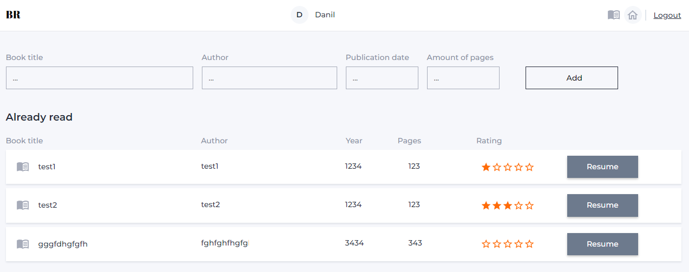

<h1 align="center">Book Reading</h1>
<h2 align="center">

## Features

1. User-friendly Interface
   Intuitive design for easy navigation.
   Minimalistic layout to enhance focus on the content.
2. Reading Tracker
   Keep track of your reading progress for each book.
   Set reading goals and challenge yourself to read more.
3. Book Reviews and Ratings
   Share your thoughts on books by leaving reviews and ratings.

## Getting Started

1. Sign Up or Log In
2. Create the Library
3. Start Reading!

## Technologies and libraries used to create the project:

- This project was created with the help of [Vite + React](https://github.com/vitejs/vite)
- [React Redux](https://react-redux.js.org)
- [Redux Toolkit](https://redux-toolkit.js.org)
- [Redux Persist](https://github.com/rt2zz/redux-persist)
- [React Router Dom](https://reactrouter.com/en/main)
- [Emotion Styled](https://emotion.sh/docs/styled)
- [Mui](https://mui.com)
- [Axios](https://axios-http.com/ru/docs/intro)
- [Chart.js](https://www.chartjs.org/)
- [React Responsive](https://github.com/yocontra/react-responsive)
- HTML
- CSS

## Live page

Live page can be accessed via https://dtripled.github.io/BookReading/
